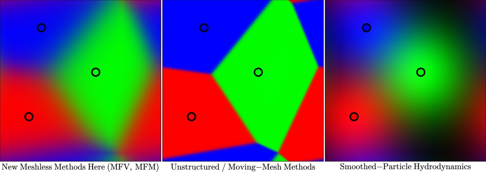

.. _datafields:

**********************************
Data Fields In STARFORGE Snapshots
**********************************

The basic dataset of a STARFORGE simulation consists of a set of chronologically-ordered snapshots containing different "particle" types. By particle, we simply mean the data structure of a point in space with certain associated properties. However, some particle types do behave like actual physical particles.

This article documents the different data fields; for guidance on how to interact with the snapshots in your analysis, check out :ref:`interfacing`.

Common data fields 
==================
Both gas and star particles will have these basic data fields.
``PartType0/Coordinates``: The coordinates of the center of the particle. For non-cosmological simulations, these are physical coordinates. For cosmological simulations, they are co-moving, so multiply by the cosmological scale-factor to get the physical coordinates.

``PartType0/Masses``: The mass of the particle in code mass units.

``PartType0/Metallicity``: The metallicity of the particle in mass fraction units.

Each particle will have an array of mass fractions for each species, with corresponding Solar values given in parentheses:
   0. All elements heavier than He (0.0142)
   1. He (0.27030)
   2. C (2.53e-3)
   3. N (7.41e-4)
   4. O (6.13e-3)
   5. Ne (1.34e-3)
   6. Mg (7.57e-4)
   7. Si (7.12e-4)
   8. S (3.31e-4)
   9. Ca (6.87e-5)
   10. Fe (1.38e-3)

The trailing 3 fields are special feedback tracer fields, storing the mass fraction of gas that originated in 3 different stellar feedback processes:
   11. Protostellar jets/outflows
   12. Stellar winds
   13. Supernovae

``PartType0/Velocities``: For non-cosmological simulations, this is simply the velocity of the particle in code velocity units. For cosmological setups, this quantity is related to the canonical momentum; multiply by the square-root of the cosmological scale factor to get the physical velocity.

``PartType0/ParticleIDs``: The almost-unique identifier of a particle; use this to track and identify individual particles. **Exception**: new gas cells injected into the simulations as stellar feedback get a special ID that flags them as such: ``1913298393``. idk why this was chosen.

``PartType0/ParticleChildIDsNumber``: If a particle was spawned in to the simulation, this is its age rank among its siblings spawned from the same particle.

``PartType0/ParticleIDGenerationNumber``: The ID of the particle that spawned this particle, else 0 of the particle is not a spawned particle.

Gas Data 
========
In GIZMO snapshots, particle type 0 always represents the gas elements in the simulation.

What *is* a gas cell in a GIZMO MFM/MFV simulation?
^^^^^^^^^^^^^^^^^^^^^^^^^^^^^^^^^^^^^^^^^^^^^^^^^^^
Short answer: **it's not an SPH particle.**

Long answer:

This is actually kind of a tricky concept. In a finite-volume grid code, the cells represent physical, geometrically-demarcated sub-volumes of the simulation domain. In an SPH simulation, the gas particles are physical blobs of gas interacting through a force law. GIZMO MFM/MFV gas cells are neither. The data structure used is similar to the particle list in SPH, but the actual way conservation laws are solved is much more closely related to the finite-volume code.

An easier concept to wrap one's head around is the Voronoi tesselation: given a set of mesh-generating points, the Voronoi tesselation is the set of sub-volumes of the domain consisting of points grouped by their closest mesh-generating point. In a Voronoi tesselation, 100% of the "weight" of each point in space is assigned to the nearest mesh-generating point (see panel 2 below).

The discretization used in GIZMO's MFM/MFV methods is a generalization of the Voronoi tesselation. Instead of associating 100% of each point in space with one mesh-generating, a *weighting function* is defined to decide what *fraction* of each point belongs to each mesh-generating point. A pretty accurate way to think of it is as a Voronoi tesselation with blurry boundaries (panel 1 above). Then, the distinction between MFM and MFV lies in what is assumed about the motion of the points: the MFM method (used in all current STARFORGE simulations) is constructed so that the points move in a way where the different subdomains exchange 0 mass in a timestep. This leads to a quasi-Lagrangian method that allows us to follow gas elements of fixed mass.

This details matter for how the simulation is run, but once we have the outputs it's usually fine to think of the gas cells as a collection of particles and analyze and interpret the data as you would e.g. an SPH particle dataset. Or, take the coordinates to be mesh-generating points of a Voronoi tesselation if you have something that can analyze that.

Gas data fields
^^^^^^^^^^^^^^^
``PartType0/Density``: The average density of a gas cell (=mass/volume) in code units. In cosmological runs this is comoving density: divide by a^3 to get physical density.

``PartType0/DustToGasRatio_Local``: The local dust-to-gas mass ratio.

``PartType0/ElectronAbundance``: Number of free electrons per H nucleon

``PartType0/HII``: Abundance of H+

``PartType0/InternalEnergy``: Thermal energy per unit mass in code units.

``PartType0/MagneticField``: Magnetic field in code units.

``PartType0/MolecularMassFraction``: Fraction of *neutral* H that is molecular.

``PartType0/NeutralHydrogenAbundance``: Fraction of H nuclei that are in neutral species.

``PartType0/PhotonEnergy``: **Total** photon energy associated with the gas cell, in code energy = code mass * code speed^2. You have to divide this by the volume (V=mass/density) to get the radiation energy density. In RT runs this generally comes in 5 bands:
   0. **Lyman continuum (13.6eV+)**: this ionizes stuff and heats HII regions up to ~10^4K
   1. **Photoelectric FUV (8-13.6eV)**: this is the band relevant for the grain photoelectric effect, which is a key heat source for the ISM.
   2. **Near UV (3.4-8eV)**: carries much of the energy and momentum in the SED emitted by a young stellar population.
   3. **Optical-near IR (0.4-3.4eV)**: Also carries signficant momentum; the main component of the interstellar radiation field responsible for heating dust in the diffuse ISM.
   4. **Mid-far IR**: variable-temperature blackbody component sourced by gas cooling and dust emission.

``PartType0/PhotonFluxDensity`` Photon flux density in units of code energy / area / time; 3D vector for each of the bands described above.

``PartType0/Dust_Temperature``: The temperature of a dust grain in K. Obtained by neglecting dust heat capacity and solving for the equilibrium of dust-gas thermal coupling, radiative absorption, and radiative emission, using grain size-integrated dust opacities and gas collision cross sections. Note that this neglects variations in grain composition, and stochastic heating of small grains.

``PartType0/IRBand_Radiation_Temperature``: Effective blackbody temperature of the variable-SED far-IR radiation band.

``PartType0/Potential``: Value of the gravitational potential at the location of the particle in code speed^2

``PartType0/Pressure``: Pressure in code units

``PartType0/SmoothingLength``: Radius of the kernel function in code length

``PartType0/Temperature``: Temperature in K

Sink particles
==============
In STARFORGE, each star lives inside a sink particle. The sink particle is the construct that actually interacts with the simulation domain, and the star itself is considered to be an unresolved structure modeled at the sub-grid level. 

Note that the sink particle implementation in GIZMO was originally developed do model black holes, so the abbreviation ``BH`` appears quite often.

Data Fields
^^^^^^^^^^^
``PartType5/BH_AccretionLength``: Sink particle search radius for accretion and feedback injection.

``PartType5/BH_Mass``: Mass of the sub-grid star in code mass units.

``PartType5/BH_Mass_AlphaDisk``: Mass of the sub-grid accretion reservoir in code units. Mass accreted by the sink first goes into this reserver; it is then smoothly accreted by the star according to a subgrid accretion prescription.

``PartType5/BH_Mdot``: Subgrid mass accretion rate.

``PartType5/BH_Specific_AngMom``: Specific angular momentum in units of code length * code speed

``PartType5/Mass_D``: Mass of deuterium remaining in the star.

``PartType5/ProtoStellarAge``: Time at which the sink particle formed in code time units (= code length / code speed)

``PartType5/StellarFormationTime``: Time since the star advanced a phase in the protostellar evolution model.

``PartType5/ProtoStellarStage``: Stage of protostellar evolution, following Offner 2009:

   0. Pre-collapse
   1. No burning
   2. Code D burning at fixed Tc
   3. Cord D burning at variable Tc
   4. Shell D burning
   5. Main Sequence
   6. Remnant
``PartType5/ProtoStellarRadius_inSolar``: Radius of the star in Solar radii

``PartType5/SinkInitialMass``: Mass of the gas cell when it turned into a sink particle.

``PartType5/SinkRadius``: Radius of the sink particle, outside of which particles are ineligible for accretion.

``PartType5/StarLuminosity_Solar``: Total bolometric luminosity of the protostar in Solar luminosity.

``PartType5/ZAMS_Mass``: This is the running maximum mass that a star has ever had. Once the star has actually reached the Main Sequence, this is what we consider to by the Zero-Age Main Sequence mass for the purposes of mapping onto stellar evolution grids.