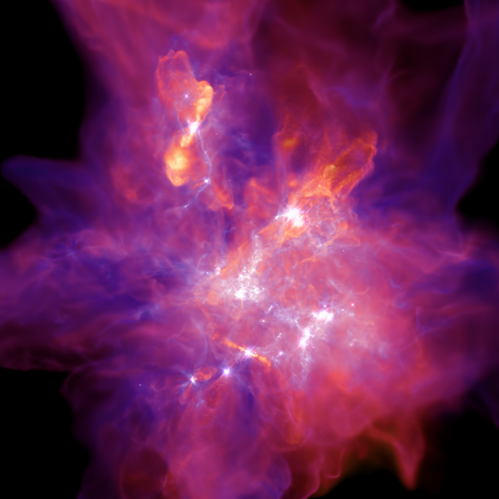

STARFORGE Documentation
===================================

.. toctree::
   :maxdepth: 1
   :caption: Analyzing existing simulations:

   data
   wiki_pages/interfacing_with_gizmo_starforge_hdf5_outputs
   wiki_pages/reading_bhswallow_and_bhformation_datafiles   
   wiki_pages/fitting_to_a_power-law_or_schechter_function

.. toctree::
   :maxdepth: 1
   :caption: Running your own simulations:

   wiki_pages/compiler_flags_for_different_starforge_setups
   wiki_pages/getting_settup_on_frontera_stampede_tacc_systems
   wiki_pages/machine-specific_tips_notes_and_submit_scripts
   wiki_pages/analyzing_code_performance_with_vtune
   wiki_pages/black_hole-gmc_encounter_setups
   wiki_pages/notes_for_setting_up_turbsphere_runs
   wiki_pages/running_gizmo_on_bridges-2_anvil_amd_epyc_systems

.. toctree::
   :maxdepth: 1
   :caption: Other Workflows:
   
   wiki_pages/hpc_linux_tips_tricks
   wiki_pages/setting_up_ffmpeg

Indices and tables
==================

* :ref:`genindex`
* :ref:`modindex`
* :ref:`search`

