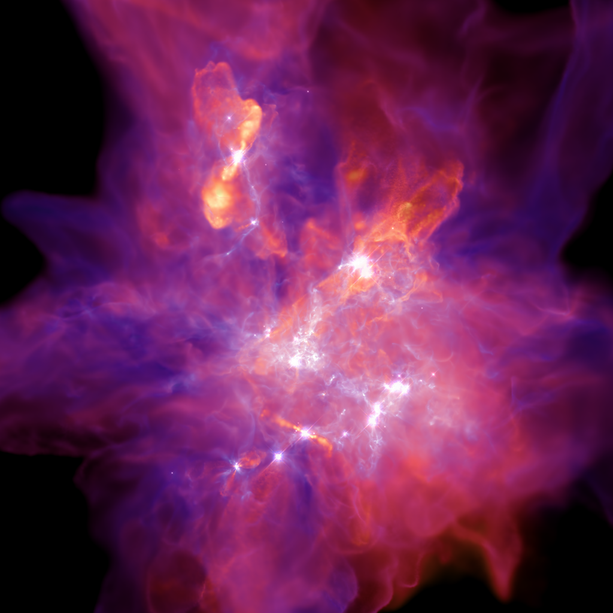

STARFORGE Documentation
===================================

.. toctree::
   :maxdepth: 1
   :caption: Getting the data

   getdata

.. toctree::
   :maxdepth: 1
   :caption: Version History:

   wiki_pages/version_history

.. toctree::
   :maxdepth: 1
   :caption: Analyzing existing simulations:

   data
   wiki_pages/interfacing_with_gizmo_starforge_hdf5_outputs
   wiki_pages/reading_bhswallow_and_bhformation_datafiles

.. toctree::
   :maxdepth: 1
   :caption: Running your own simulations:

   wiki_pages/getting_the_code
   wiki_pages/compiler_flags_for_different_starforge_setups
   wiki_pages/getting_setup_on_tacc_systems
   wiki_pages/running_on_other_machines
   wiki_pages/analyzing_code_performance_with_vtune
   wiki_pages/notes_for_setting_up_turbsphere_runs

.. toctree::
   :maxdepth: 1
   :caption: Other Workflows:

   wiki_pages/hpc_linux_tips_tricks

.. toctree::
   :maxdepth: 2
   :caption: Python package
   
   API

.. toctree::
   :maxdepth: 1
   :caption: Community

   community

Indices and tables
==================

* :ref:`genindex`
* :ref:`modindex`
* :ref:`search`

