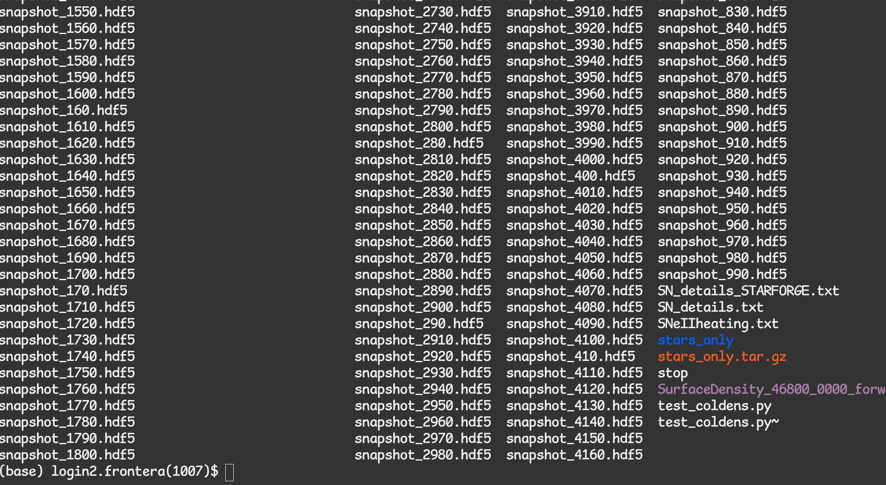
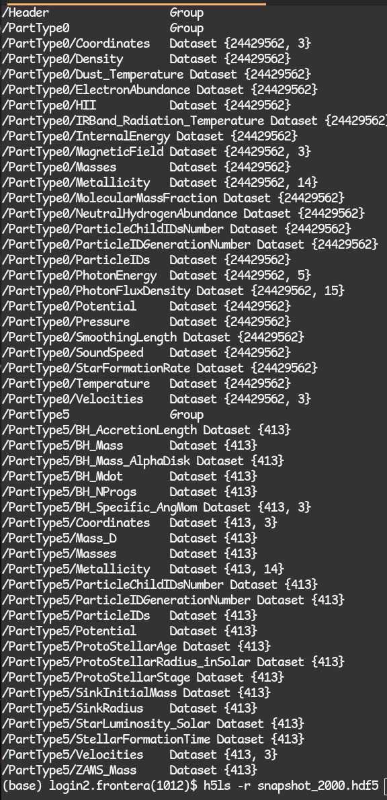
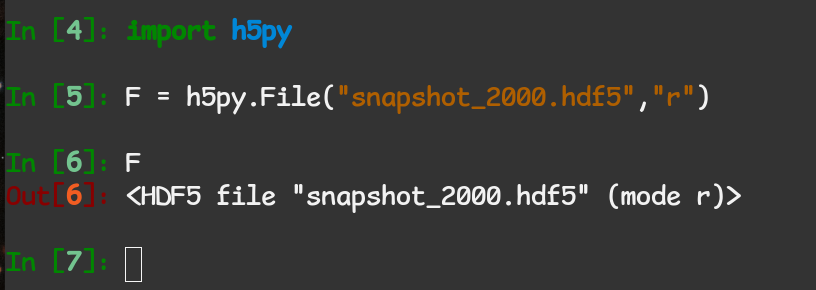
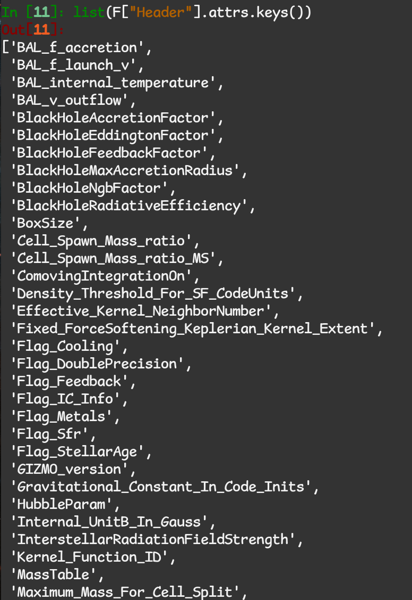
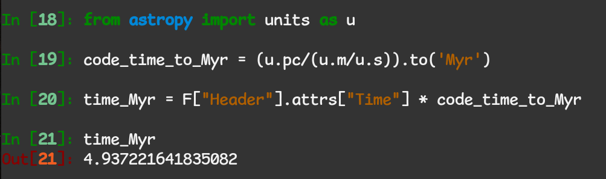
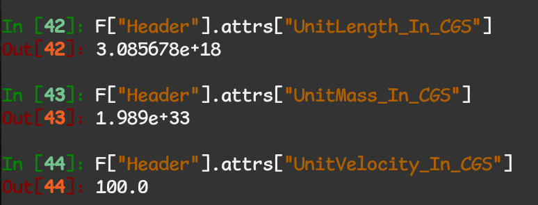
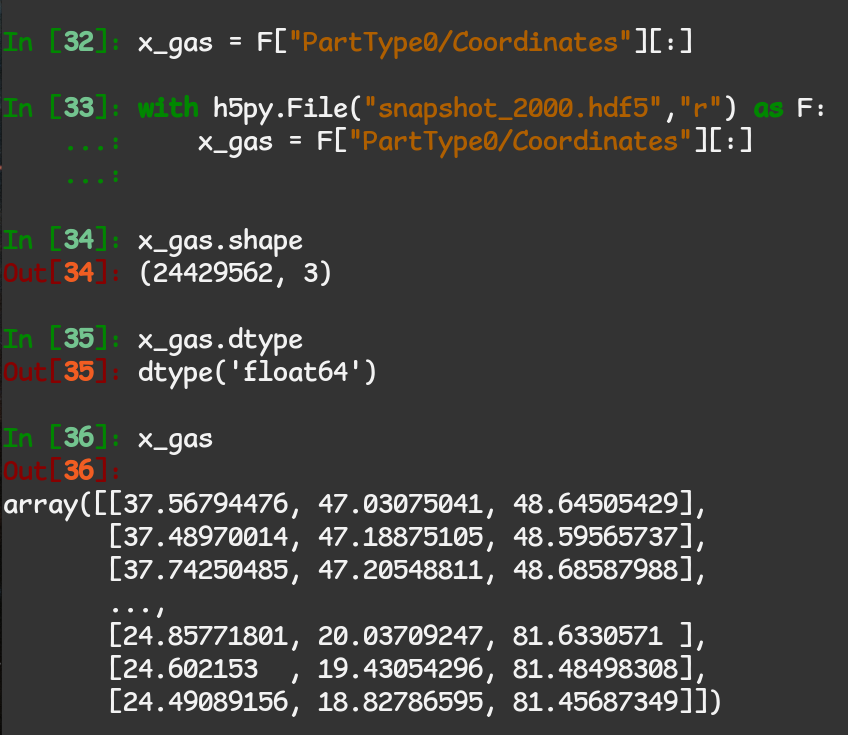

.. _interfacing

Interfacing with GIZMO/STARFORGE HDF5 outputs
~~~~~~~~~~~~~~~~~~~~~~~~~~~~~~~~~~~~~~~~~~~~~

The Format
^^^^^^^^^^

STARFORGE simulation data are stored in the `Hierarchical Data Format 5 (HDF5) <https://www.hdfgroup.org/solutions/hdf5/>`__ format. The directory of any STARFORGE (or generally GIZMO) simulation will consist primarily of a set of .hdf5 files:

|screenshot_from_2024-07-10_12-56-16.png|

You can check the contents and structure of these files with the ``h5ls`` tool:

|screenshot_from_2024-07-10_12-59-32.png|

Note that there is a ``Header`` containing metadata about the simulation, and there is the actual particle data. Each ``PartType`` is for a specific type of particle represented in the simulation.

- 0: Gas
- 1-3: Various dark matter/collisionless particle types (not used in STARFORGE, but present in FORGE’d In FIRE type setups)
- 4: Stellar populations/clusters (again not in normal STARFORGE cloud runs, but found in FIRE galaxy simulations)
- 5: Sink particles, representing stars or black holes.

For a detailed explanation of the data fields, see :ref:`datafields`.

Note the array shapes reported by ``h5ls`` for the different datasets. Each dataset is a 1- or 2-dimensional array where each entry in the first index corresponds to a particle. In our example above, there are 24429562 type 0 (gas) particles in the simulation, and each has a 3D coordinate, so the shape of ``PartType0/Coordinates`` is ``{24429562,3}``. For a description of what each data field represents, please see the `GIZMO Documentation <http://www.tapir.caltech.edu/~phopkins/Site/GIZMO_files/gizmo_documentation.html>`__.

Except where otherwise specified (e.g. stellar luminosities and radii are in Solar units), particle data are in \*code units\*. The standard code units used in STARFORGE simulations to date (7/10/2024) are:

- Length: parsec
- Speed: m/s
- Mass: 1 Solar mass
- Magnetic field: Tesla

Note that all other dimensional quantities’ units can be derived from the above. E.g., the unit time is ``1pc / 1m/s = 979Myr``.

If in doubt, you can check the units system in the Header, which brings us to the next section.

Loading data with h5py
^^^^^^^^^^^^^^^^^^^^^^

``h5py`` is the tool of choice for loading the data into convenient array formats to work with in Python. It can be installed with any Python package manager such as ``pip`` or ``conda``. You can load into a file object with the ``File`` class:

|screenshot_from_2024-07-10_13-27-35.png|

The Header
''''''''''

The Header contains important metadata about the parameters of the simulation. It is also where you will find the simulation time. Let’s get a full list of everything in our header:

|screenshot_from_2024-07-10_13-30-24.png|

Each of these entries is a property of the simulation itself, or the snapshot. To get the simulation time in sensible units:

|screenshot_from_2024-07-10_13-34-03.png|

Notice that we access the header data via the ``.attrs`` attribute - this is only the case for header data.

Getting the code units
''''''''''''''''''''''

As mentioned, the header contains information about the units system adopted by the simulation: |screenshot_from_2024-07-10_13-52-06.png|

You can use these to fully automate the unit conversions performed in an analysis script, or to inform other packages such as ``yt`` about your units system. It is highly recommended to use existing units packages such as ``astropy.units`` to perform all unit conversions, so that your code is not redundantly defining magic numbers for the conversions and it is easy to change units system if needed.

Accessing Particle Data
'''''''''''''''''''''''

The easiest way to load particle data into a numpy array is by accessing the dataset from the File object and slicing it:

|screenshot_from_2024-07-10_13-40-35.png|

We see that we have a double-precision Nx3 array of 3D particle coordinates in code units, which in this instance is parsecs. We are now free to plug this into any other python routine that operates on array-like objects. Note that opening the file with a ``with`` statement is considered best practice because the file is only open while you are actually performing IO, and will be automatically closed afterward.

You can access the datasets in various ways, e.g. instead of ``F[“PartType0/Coordinates”][:]`` we could have said ``F[“PartType0”][“Coordinates”]``. For an easy one-liner to get all gas data IO stored in a dict, you could do ``gasdata = {k: F[“PartType0”][k][:] for k in F[“PartType0”]}`` and then access it like e.g. ``x_gas = gasdata[“Coordinates”]``.

This concludes the STARFORGE/GIZMO/HDF5-specific part of the analysis workflow. For a useful package that can perform many operations useful for visualization or analysis of unstructured/particle-based simulation data, see `meshoid <https://github.com/mikegrudic/meshoid>`__.

